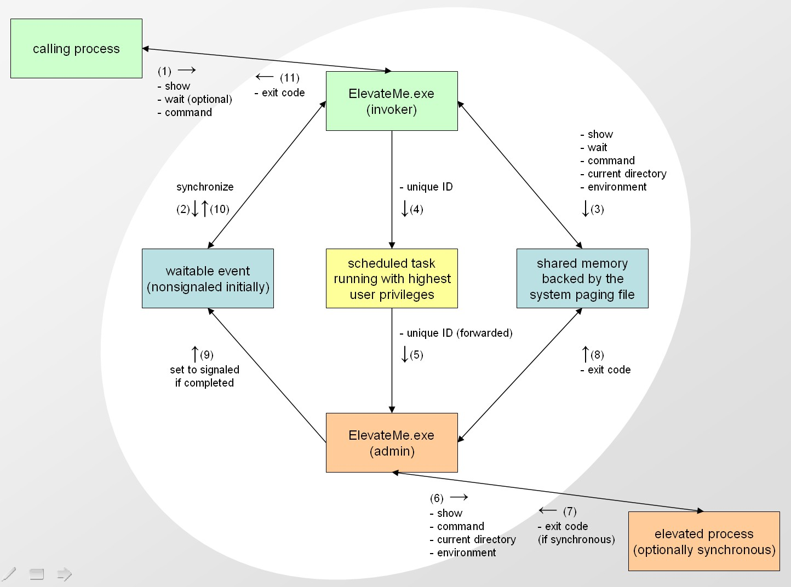

----

### Description:  
**ElevateMe** provides a way to run Windows applications with the highest available privileges of the current user without UAC confirmation. This enables automation scripts to run unattended.  

ElevateMe targets end users on their home computers where they belong to the local Administrators group.  

The elevated process is executed in the current working directory of the calling process. Also, all environment variables set in the calling process are copied to the elevated process, which provides another option to transfer information to the elevated process.  

*\* Use at your own risk. \**  

----

### Installation:  
1. Make sure "ElevateMe.exe" and "Install_ElevateMe.ps1" are in the same directory.  
2. Run "Install_ElevateMe.ps1" to perform these actions:  
   - File "ElevateMe.exe" is copied to "%USERPROFILE%\AppData\Local\ElevateMe\" (where %USERPROFILE% is typically C:\Users\\<your user name\>).  
   - Scheduled Task "ElevateMe" is created.  
   - "%USERPROFILE%\AppData\Local\ElevateMe" is added to the PATH environment of the current user.  

----

### Syntax:  
**`ElevateMe.exe show [wait] command`**  

| argument | description |  
| --- | --- |  
| show | Integer value that specifies the window appearance of the elevated process.  When in doubt choose 1, 3 or 7. No other values are recommended.  Supported values are:  &nbsp; 0 &nbsp; Hide the window and activate another window.  &nbsp; 1 &nbsp; Activate and display the window.  &nbsp; 2 &nbsp; Activate and minimize.  &nbsp; 3 &nbsp; Activate and maximize.  &nbsp; 4 &nbsp; Restore. The active window remains active.  &nbsp; 5 &nbsp; Activate and Restore.  &nbsp; 6 &nbsp; Minimize and activate the next top-level window in the Z order.  &nbsp; 7 &nbsp; Minimize. The active window remains active.  Carefully use 0, take into account that you are not able to interact with a hidden window that tries to prompt you for input. |
| wait  (optional) | Integer value that specifies whether or not the elevated process is synchronized with the execution of the calling process.  Value 0 is for "false", any other value is for "true".  If omitted, the elevated process is not synchronized ("false"). That is, the calling process does not wait for the elevated process to terminate before it resumes the execution. |
| command | One or more tokens that collectively form the command, where the first token is the name of the application (\*.exe, \*.com) to be executed with elevated privileges. |

### Examples:
- Open an elevated command prompt in a normal window. The wait argument is omitted and defaults to 0.  
`ElevateMe.exe 1 cmd.exe /k`  

- Run script "example.ps1" elevated in a maximized window. Wait for the termination of the PowerShell process.  
`ElevateMe.exe 3 1 powershell.exe -File "example.ps1"`  

----

### Return value:  
- If an error occurs, the application will return a Windows HRESULT code. Examples:  0x80070057 (-2147024809) for "The parameter is incorrect." indicates that the ElevateMe call does not meet the required syntax.  0x80070002 (-2147024894) for "The system cannot find the file specified." indicates that a wrong name was specified in the command for the elevated process.  
- Else if not synchronized, 0 is returned.  
- Else the application returns the exit code of the elevated process to the caller.  

----

### Workflow:  
This figure illustrates the design.  
Note that there are two instances of "ElevateMe.exe". The first is created by the user, the second is created by the scheduled task with highest available privileges.  

  
